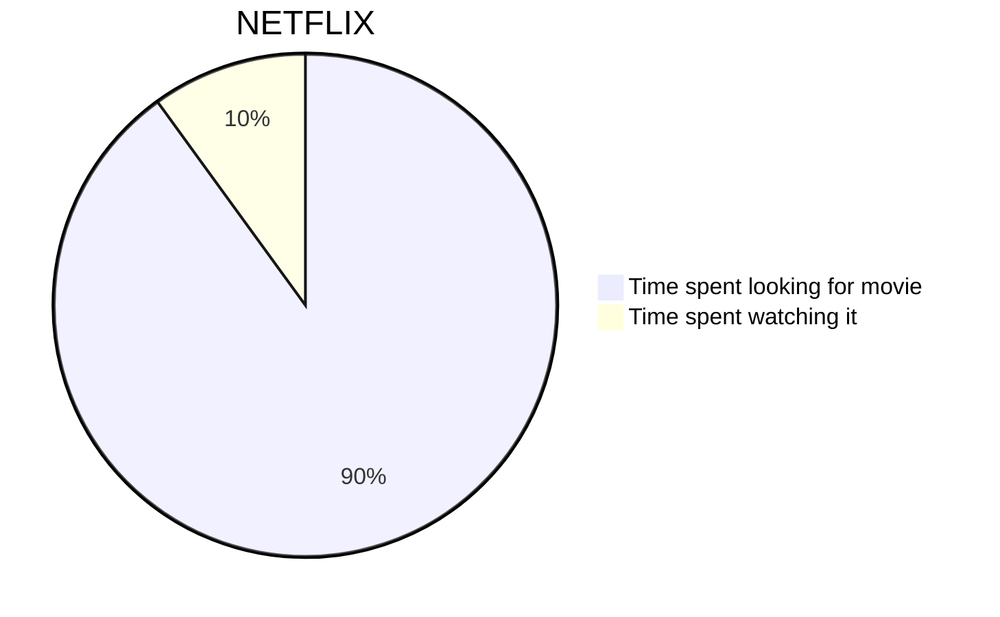
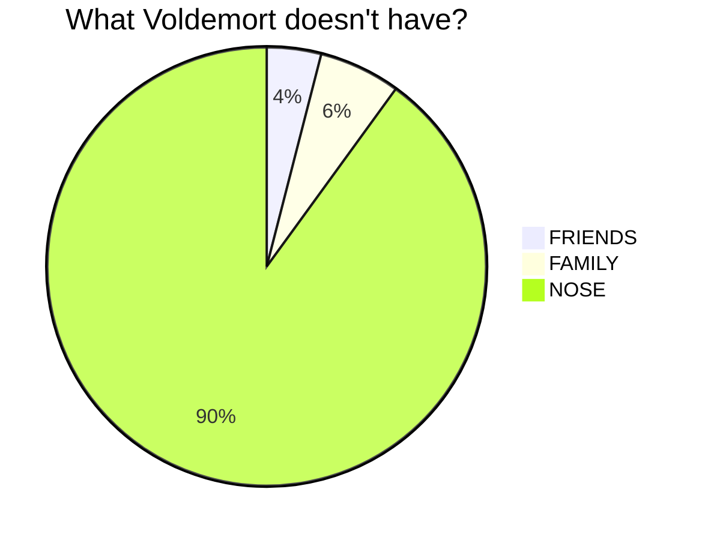
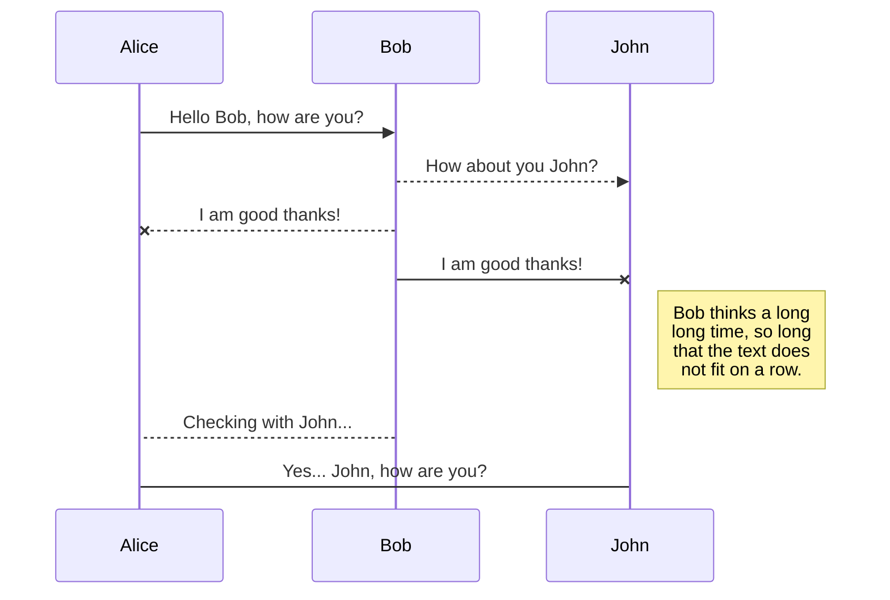
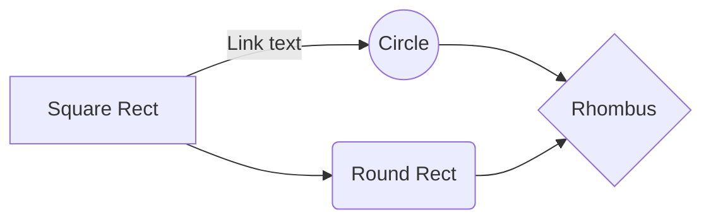
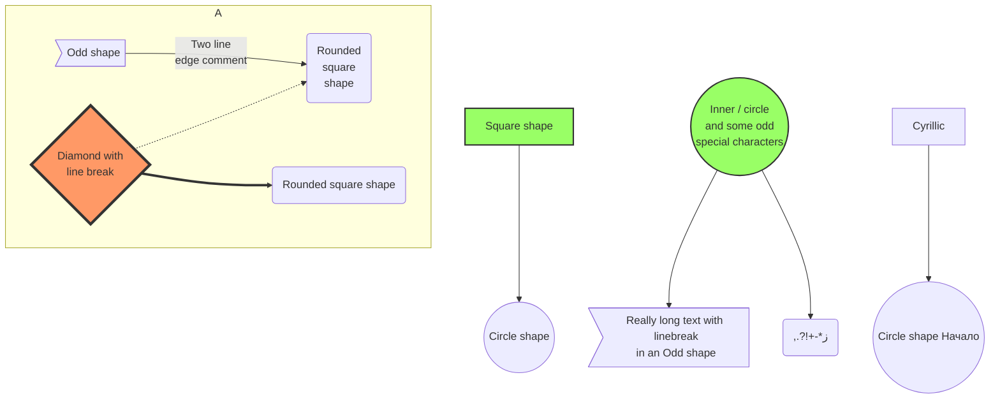
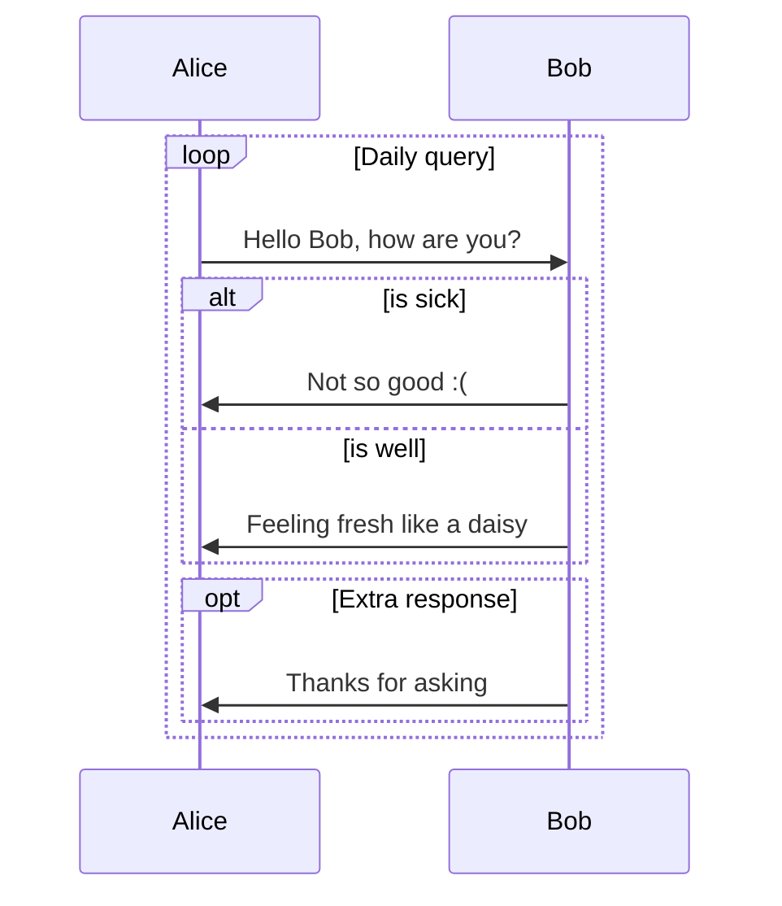
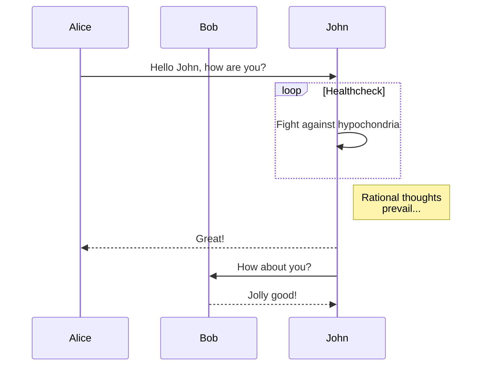

# Examples

This page contains a collection of examples of diagrams and charts that can be created through mermaid and its myriad applications.

**If you wish to learn how to support mermaid on your webpage, read the [Beginner's Guide](/usage?id=usage).**

**If you wish to learn about mermaid's syntax, Read the [Diagram Syntax](/flowchart?id=flowcharts-basic-syntax) section.**

## Basic Pie Chart

```
pie title NETFLIX
         "Time spent looking for movie" : 90
         "Time spent watching it" : 10
```

```
pie title What Voldemort doesn't have?
         "FRIENDS" : 2
         "FAMILY" : 3
         "NOSE" : 45
```

## Basic sequence diagram

```
sequenceDiagram
    Alice ->> Bob: Hello Bob, how are you?
    Bob-->>John: How about you John?
    Bob--x Alice: I am good thanks!
    Bob-x John: I am good thanks!
    Note right of John: Bob thinks a long<br/>long time, so long<br/>that the text does<br/>not fit on a row.

    Bob-->Alice: Checking with John...
    Alice->John: Yes... John, how are you?
```


## Basic flowchart

```
graph LR
    A[Square Rect] -- Link text --> B((Circle))
    A --> C(Round Rect)
    B --> D{Rhombus}
    C --> D
```



## Larger flowchart with some styling

```
graph TB
    sq[Square shape] --> ci((Circle shape))

    subgraph A
        od>Odd shape]-- Two line<br/>edge comment --> ro
        di{Diamond with <br/> line break} -.-> ro(Rounded<br>square<br>shape)
        di==>ro2(Rounded square shape)
    end

    %% Notice that no text in shape are added here instead that is appended further down
    e --> od3>Really long text with linebreak<br>in an Odd shape]

    %% Comments after double percent signs
    e((Inner / circle<br>and some odd <br>special characters)) --> f(,.?!+-*ز)

    cyr[Cyrillic]-->cyr2((Circle shape Начало));

     classDef green fill:#9f6,stroke:#333,stroke-width:2px;
     classDef orange fill:#f96,stroke:#333,stroke-width:4px;
     class sq,e green
     class di orange
```



## SequenceDiagram: Loops, alt and opt

```
sequenceDiagram
    loop Daily query
        Alice->>Bob: Hello Bob, how are you?
        alt is sick
            Bob->>Alice: Not so good :(
        else is well
            Bob->>Alice: Feeling fresh like a daisy
        end

        opt Extra response
            Bob->>Alice: Thanks for asking
        end
    end
```



## SequenceDiagram: Message to self in loop

```
sequenceDiagram
    participant Alice
    participant Bob
    Alice->>John: Hello John, how are you?
    loop Healthcheck
        John->>John: Fight against hypochondria
    end
    Note right of John: Rational thoughts<br/>prevail...
    John-->>Alice: Great!
    John->>Bob: How about you?
    Bob-->>John: Jolly good!
```



## SequenceDiagram: All in ONE_gsc

```
sequenceDiagram
%% title
	title: Test of Eve
	
%% sequenceNumbers
	autonumber

%% backeground highlighting, the colors are define using rgb
rect rgb(0, 255, 0)
	par Alice ask Bob
		Alice ->> Bob: Bob, you have a Test?
	and Bob answer Alice
		Bob -->> Alice: Oh, my God, I forgot this Test.
	and Alice ask John
		Alice ->> John: And you?
	and John' answer
		John -->> Alice: OK!
	end
end

	%% Aliases
	participant T as Tom
	
	%% Messages
	Alice ->> T: wake...
	Bob ->> T: Tom.
	John ->> T: breakfast.

%% backeground highlighting, the colors are define using rgba,多了透明的选项
rect rgb(255, 240, 230, 0.8)
rect rgb(255, 0, 0, 0.5)
	%% Loops
	loop repeated Every minute
		Alice ->> Bob: Will we doing something?
		Bob -->> Bob: I don't know!
	end
end	
	%% Note
	Note right of Bob: Oh, shit.
	Note left of Alice: God, help me.
	Note over Alice, Bob: Help, help...
	Note left of Tom: Rest is importand!

rect rgb(187, 255, 255)
	%% Alt
	alt They have tested
		Alice ->> Bob: no problem!
		Bob -->> Alice: OK!
	else They havn't tested
		Alice ->> Bob: My God!
		Bob -->> Alice: Help
	end
end

	%% This is a comment ... 
	Tom -->> Alice: ......
	Tom -->> Bob: ~~~.
	Tom -->> John: NO, NO, NO, No, NO, NO, No.

rect rgb(255, 246, 143)
	%% Opt
	opt John have tested
		Alice -->> John: Congratulation.
		Bob -->> John: Congratulation.
	end
end
end

	%% Activations
	Alice ->> Tom: Hi, Tom, wake up.
	activate Tom
	Tom -->> Alice: No, I hava to sleep.
	deactivate Tom
	
```
